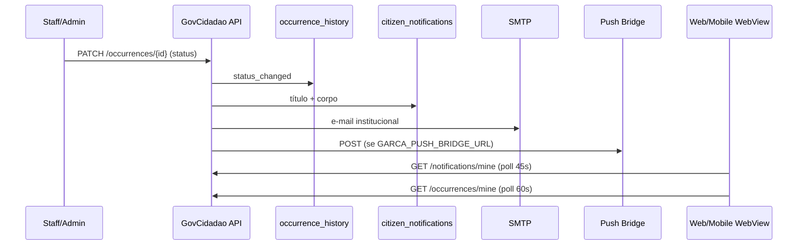

# Comunicação com o cidadão — Boca no Trombone (Garça Cidadão)

## 1. Diagnóstico da arquitetura

| Camada | Tecnologia | Papel |
|--------|------------|--------|
| API | FastAPI + Beanie/Mongo (`GovCidadao/app`) | Ocorrências, histórico, notificações in-app, e-mail |
| Web | Next.js (`GovCidadao/frontend/app/page.tsx`) | Registro, modal de sucesso, painel Minhas Reclamações |
| Mobile | Flutter WebView → Garça Cidadão `?embedded=1` | Mesma UX web com SSO |
| Usuários | Mongo integrado (`external_users`) | `role` mapeado para `citizen` / `secretary` / `admin` |
| E-mail | SMTP via env (`GOV_SMTP_*`) | Templates HTML institucionais |
| Push FCM | Ponte HTTP opcional (`GARCA_PUSH_BRIDGE_URL`) | Fase 2 — requer endpoint com token FCM do app |

**Status administrativos (inalterados):** `open`, `in_progress`, `resolved`, `canceled`  
**Labels ao cidadão:** Ativa, Em Execução, Encerrada, Cancelada

**Vínculo cidadão ↔ reclamação:** `reporter_user_id` (novo) + fallback por e-mail (`reporter_contact`).

## 2. Estratégia de implementação

- **Sem alterar** mapa, dashboard staff, categorias, secretarias, regras de triagem.
- **API mínima:** rotas aditivas (`GET /occurrences/mine`, `GET /occurrences/{id}/history`, notificações).
- **Histórico:** coleção `occurrence_history` com eventos em criação e mudança de status.
- **Notificações:** in-app (`citizen_notifications`) + e-mail + ponte push opcional.

## 3. Fluxo de notificações



## 4. Fluxo de e-mails

| Evento | Assunto (exemplo) |
|--------|-------------------|
| Criação | `[Garça Cidadão] Reclamação registrada #XXXXXXXX` |
| Mudança de status | `[Garça Cidadão] #XXXXXXXX — Em Execução` |

Variáveis: `GOV_SMTP_HOST`, `GOV_SMTP_PORT`, `GOV_SMTP_USER`, `GOV_SMTP_PASS`, `GOV_SMTP_FROM`, `GARCA_CIDADAO_PUBLIC_URL`.

## 5. Painel Minhas Reclamações

- Aba **Minhas Reclamações** (cidadão).
- Filtros: Todas, Ativas, Em Execução, Encerradas.
- Busca por protocolo (`?protocol=` na API).
- Detalhe com mensagem humanizada + timeline (`/occurrences/{id}/history`).
- Badge de novidades via notificações não lidas.

## 6. Arquivos alterados

**Backend**

- `app/models.py` — `reporter_user_id`, `OccurrenceHistory`, `CitizenNotification`
- `app/schemas.py` — `external_id`, `updated_at`, DTOs de histórico/notificação
- `app/db.py`, `app/main.py`
- `app/routers/occurrences.py` — mine, history, notificações ao criar/atualizar
- `app/routers/notifications.py` — novo
- `app/services/citizen_status.py`, `citizen_email.py`, `citizen_push.py`, `citizen_notify.py`, `occurrence_history.py`
- `requirements.txt` — `httpx`

**Frontend**

- `frontend/lib/citizenStatus.ts`
- `frontend/app/components/CitizenSuccessModal.tsx`
- `frontend/app/components/MyComplaintsPanel.tsx`
- `frontend/app/page.tsx` — integração, navegação cidadão, estilos

## 7. Push FCM (prioridade — Fase 2)

Configurar no ambiente da API:

```env
GARCA_PUSH_ENABLED=true
GARCA_PUSH_BRIDGE_URL=https://api.garca.sp.gov.br/internal/garca-cidadao/push
GARCA_PUSH_BRIDGE_SECRET=...
```

Payload enviado: `userId`, `title`, `body`, `data.occurrenceId`, `data.type=boca_trombone_status`.

O app Flutter deve expor token FCM e o bridge Node deve chamar Firebase Admin SDK (documentado em `prefeitura_app-main/docs/notificacoes_push.md`).

## 8. Testes recomendados

1. Login como cidadão → registrar reclamação → modal com protocolo.
2. Abrir **Minhas Reclamações** → ver card + timeline.
3. Admin altera status → e-mail (se SMTP) + badge in-app + mensagem humanizada.
4. WebView mobile (`embedded=1`) → mesmas abas e deep link `?tab=minhas&occurrence={id}`.

## 9. Compatibilidade

- Reclamações antigas sem `external_id` usam `id` como fallback no protocolo.
- Staff continua usando dashboard e mapa sem mudanças de contrato obrigatórias (`external_id`/`updated_at` adicionados na resposta, compatíveis).
