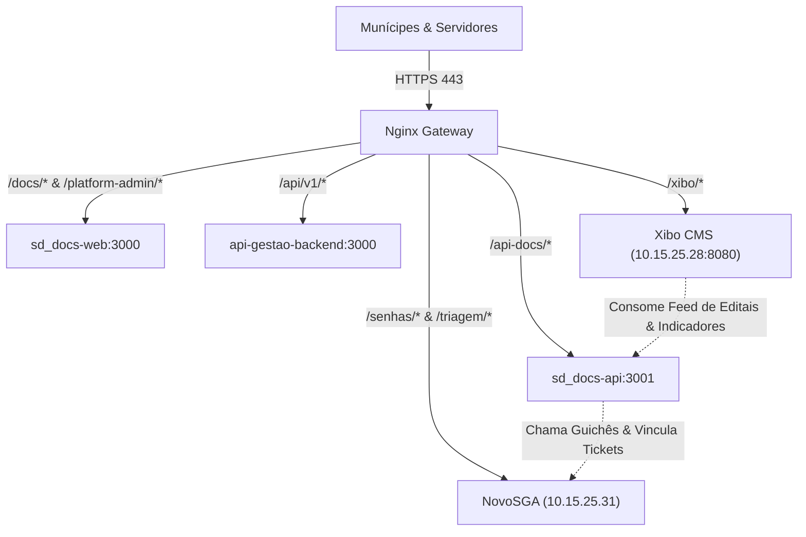

# API Gestão Pública & Plataforma Municipal Integrada

Plataforma municipal modular de serviços digitais da Prefeitura Municipal de Garça, integrando APIs, portais do cidadão, tramitação eletrônica de processos (**SD_Docs**), chamador presencial de senhas (**NovoSGA**) e TV Corporativa (**Xibo CMS**).

---

## 🏛️ Componentes Principais e Módulos

- **`SD_Docs` (Processos Eletrônicos & Assinaturas):** Monorepo NestJS + Next.js com PostgreSQL dedicado para tramitação de processos administrativos municipais e assinaturas eletrônicas.
- **`backend/`:** API Node.js/Express com PostgreSQL/MongoDB, workers de fila e autenticação municipal.
- **`frontend/`:** Portal administrativo e módulos de atendimento municipal em React.
- **`GovCidadao/`:** API e frontend Next.js para serviços ao cidadão.
- **`Ferramentas/`:** Aplicação Next.js para utilitários administrativos, ramais e conversão documental.
- **`prefeitura_app-main/`:** Aplicativos Flutter mobile (Android/iOS) e portais web.
- **`cultura-src/` e `mapaturistico/`:** Módulos de gestão de patrimônio, teatro, biblioteca e turismo.
- **`nginx/`:** Gateway e proxy reverso central (`api.garca.sp.gov.br`) com SSL/TLS e roteamento unificado.

---

## 🌐 URLs Oficiais de Produção (`api.garca.sp.gov.br`)

| Serviço / Portal | URL de Acesso | Descrição |
| :--- | :--- | :--- |
| **Painel de Processos (SD_Docs)** | `https://api.garca.sp.gov.br/docs/login` | Tramitação documental, despachos, setores e assinaturas. |
| **Painel Global (Platform Admin)** | `https://api.garca.sp.gov.br/docs/platform-admin/login` | Gestão central de prefeituras, planos e domínios. |
| **API do SD_Docs** | `https://api.garca.sp.gov.br/api-docs/` | Endpoints REST e healthcheck do motor documental. |
| **Painel de Senhas (NovoSGA)** | `https://api.garca.sp.gov.br/senhas/` e `/triagem/` | Totens e triagem presencial integrada a processos. |
| **Saguão Digital (Xibo CMS)** | `http://10.15.25.28:8080` | Gestor de conteúdo para TVs e painéis do Paço Municipal. |
| **TV Feed (Decretos & Editais)** | `https://api.garca.sp.gov.br/api-docs/public/tv-feed/edicts` | Feed público para exibição autônoma nas TVs. |
| **TV Feed (Sustentabilidade)** | `https://api.garca.sp.gov.br/api-docs/public/tv-feed/transparency` | Indicadores de economia de papel e sustentabilidade. |

---

## 🚀 Integrações de Rede e Satélites

---

## 📖 Documentação Mestre

Consulte o [**`MAPA_DO_TESOURO.md`**](file:///home/semit/Documentos/api-semit/MAPA_DO_TESOURO.md) para a referência arquitetural completa, procedimentos de contingência, segurança, rotinas de backup diário e o **Capítulo 28** dedicado à integração do SD_Docs.
