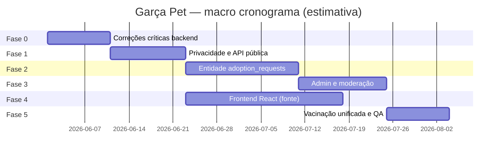
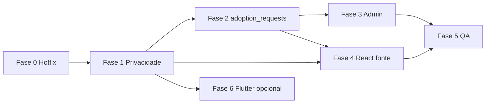

# Plano de implementação — Garça Pet (SEMIT A PET)

**Versão:** 1.1  
**Data:** 2026-05-27  
**Base:** análise de produto/UX/regras/arquitetura do módulo Doações/Adoções  
**Escopo:** backend (`backend/`), frontend Garça Pet (`backend/public/sama/` ou app React versionado), banco MongoDB, segurança e operação municipal.

### Status de implementação (2026-05-27)

| Fase | Status |
|------|--------|
| **Fase 0** — hotfix backend | ✅ Implementado |
| **Fase 1** — privacidade API + e-mails + patch UI | ✅ Implementado (parcial: fonte React ainda não versionada) |
| **Fase 2** — `adoption_requests` + fila/posição | ✅ Implementado |
| **Fase 3** — admin/moderação | ✅ Implementado (básico) |
| **Fase 4** — React fonte no repo | ⏳ Pendente |
| **Fase 5** — vacinação unificada + QA | 🔶 Parcial (`GET` vacinas exige auth) |

**Premissa:** não existe módulo de doação financeira; “doação” = cadastro de animal para adoção.

---

## 1. Objetivos do plano

| Objetivo | Métrica de sucesso |
|----------|-------------------|
| Confiabilidade do fluxo adoção | Zero sobrescrita de adotante; estados consistentes |
| Privacidade (LGPD) | PII (telefone/e-mail/endereço) só após aprovação explícita |
| Operação municipal | Fila admin para moderação, denúncias e exceções |
| Manutenibilidade | Código React versionado; `patch.js` apenas para hotfix |
| Experiência | Timeline clara para adotante e doador |

---

## 2. Princípios de desenho (decisões fechadas)

1. **Modelo híbrido de mediação:** comunicação na plataforma primeiro; contato direto liberado após status `Aprovado`; admin entra em denúncias, institutos não verificados e disputas.
2. **Solicitação de adoção como entidade própria** (`adoption_requests`), desacoplada do documento `Pet` (fase 2); fase 1 corrige o modelo atual sem migração pesada onde possível.
3. **Listagem pública** só exibe pets realmente disponíveis para adoção.
4. **Compatibilidade:** manter rotas `/pets` e `/api/pets` com versionamento ou flags até o front ser atualizado.
5. **Usuário unificado** Memorial + Garça Pet permanece; papéis Garça Pet explícitos (`pet_donor`, `pet_adopter`, `pet_moderator`) sem quebrar `role` do cemitério.

---

## 3. Visão por fases



*Datas ilustrativas — ajustar conforme capacidade da equipe.*

---

## 4. Fase 0 — Correções críticas (backend)

**Meta:** eliminar bugs de integridade e vazamento óbvio sem mudar UX ainda.

### 4.1 Tarefas

| ID | Tarefa | Arquivos principais | Critério de aceite |
|----|--------|---------------------|-------------------|
| F0-01 | Corrigir `schedule`: bloquear se `available === false` | `PetController.schedule` | 422 com mensagem clara |
| F0-02 | Corrigir `schedule`: não substituir adotante ativo de outro usuário | idem | 409 se já existe `adopter` diferente |
| F0-03 | Corrigir `schedule`: comparar IDs sem depender de `populate` | idem | Sem `TypeError` em pet sem populate |
| F0-04 | Corrigir `cancelAdoption`: `isOwner` com `pet.user` ObjectId ou populado | `PetController.cancelAdoption` | Doador cancela com sucesso |
| F0-05 | Filtrar `GET /pets`: `available: true` e excluir `adopterStatus: Finalizado` | `PetController.getAll` | Listagem só pets adotáveis |
| F0-06 | Validar `gender` e `breed` no `create`/`update` | `PetController` | 422 se ausentes/inválidos |
| F0-07 | `Recusado`: definir regra — limpar `adopter`, manter histórico em messages, `available: true` | `updateAdopterStatus` | Pet volta à listagem após recusa |
| F0-08 | `updateAdopterStatus`: não gravar mensagem system se `status` undefined | idem | Sem mensagem “undefined” |
| F0-09 | Testes de integração: schedule, cancel, getAll, recusa | `backend/tests/` ou script e2e | CI verde nos cenários |

### 4.2 Entregável

- Release **v0.9.1-pet-hotfix** (tag interna).
- Nota de deploy para equipe SAMA.

### 4.3 Riscos

- Front antigo pode depender de listar todos os pets no admin — validar se existe tela que usa `GET /pets` para gestão (usar `/mypets` ou novo endpoint admin).

---

## 5. Fase 1 — Privacidade e perfis públicos

**Meta:** LGPD alinhada ao modelo híbrido (contato após aprovação).

### 5.1 Tarefas

| ID | Tarefa | Detalhe | Critério de aceite |
|----|--------|---------|-------------------|
| F1-01 | Criar `toPublicProfile(level)` | `public` \| `participant` \| `admin` | Função única no controller |
| F1-02 | Listagem/detalhe público: só `name`, `image`, `userType`, `instituteName` | `GET /`, `GET /:id` visitante | Sem phone/email |
| F1-03 | Detalhe para participantes (doador/adotante do processo): PII completa | middleware ou checagem no controller | 403 se não participante |
| F1-04 | E-mail `notifyAdoptionRequested`: sem telefone/e-mail do adotante; link para painel | `notifyAdoptionRequested` | Template revisado |
| F1-05 | E-mail status `Aprovado`: incluir orientação de contato via plataforma | `notifyAdoptionStatusUpdated` | Só após aprovado |
| F1-06 | Exigir `deliveryAddress` ou `message` mínima no `schedule` | body validation | 422 se vazio |
| F1-07 | Documentar contrato API em `endpoints.html` / OpenAPI | docs | Campos por nível de visibilidade |

### 5.2 Ajuste mínimo no front (patch ou React)

| ID | Tarefa | Critério |
|----|--------|----------|
| F1-08 | Modal detalhe: não renderizar telefone até status ≥ Aprovado | QA manual |
| F1-09 | Mensagem pós-solicitação: “Aguarde análise; contato após aprovação” | Texto na UI |

### 5.3 Entregável

- API compatível com versão anterior via header opcional `X-Api-Version: 2` (opcional) ou breaking change documentada.

---

## 6. Fase 2 — Entidade `adoption_requests`

**Meta:** suportar histórico, uma solicitação ativa por pet, cancelamento pelo adotante.

### 6.1 Modelo de dados

**Collection:** `adoption_requests`

```javascript
{
  pet: ObjectId,
  adopter: ObjectId,
  status: enum [
    'enviada', 'em_analise', 'aprovada', 'recusada',
    'cancelada_adotante', 'cancelada_doador', 'concluida'
  ],
  message: String,
  deliveryPreference: String,  // endereço ou observação
  messages: [{ role, message, createdAt }],
  concludedAt: Date,
  createdAt, updatedAt
}
```

**Pet (simplificado após migração):**

- `available: Boolean`
- `publicationStatus: enum ['rascunho','publicado','suspenso','adotado']` (novo)
- Remover ou deprecar `adopter`, `adopterStatus`, `adopterMessages` (manter leitura legada 1 release)

### 6.2 Tarefas

| ID | Tarefa | Critério de aceite |
|----|--------|-------------------|
| F2-01 | Schema + índices `{ pet: 1, status: 1 }`, `{ adopter: 1 }` | Migrations script |
| F2-02 | `POST /pets/:id/adoption-requests` substitui `schedule` | Uma ativa por pet |
| F2-03 | `PATCH /adoption-requests/:id/status` (doador/admin) | Máquina de estados |
| F2-04 | `POST /adoption-requests/:id/messages` | Chat na solicitação |
| F2-05 | `DELETE /adoption-requests/:id` (adotante cancela) | Status `cancelada_adotante` |
| F2-06 | `POST /adoption-requests/:id/conclude` | Pet `adotado`, request `concluida` |
| F2-07 | Script migração: pets com `adopter` → request ativa | ❌ Não aplicável (dados antigos são testes) |
| F2-08 | Deprecar rotas antigas com aviso 6 meses | Log deprecation |

### 6.3 Máquina de estados (solicitação)

| De | Para | Quem |
|----|------|------|
| — | enviada | Adotante |
| enviada | em_analise | Doador, moderador |
| em_analise | aprovada \| recusada | Doador, moderador |
| aprovada | concluida | Doador, moderador |
| enviada / em_analise | cancelada_adotante | Adotante |
| * | cancelada_doador | Doador, moderador |

---

## 7. Fase 3 — Administração e moderação municipal

**Meta:** operação pública com controle e auditoria.

### 7.1 Tarefas

| ID | Tarefa | Critério de aceite |
|----|--------|-------------------|
| F3-01 | Papel `pet_moderator` ou uso consistente de `isAdmin` + doc | Matriz de permissões única |
| F3-02 | `GET /admin/pets/pending` — pets `rascunho` ou denunciados | Painel lista |
| F3-03 | `PATCH /admin/pets/:id/publish` \| `suspend` | Moderação anúncio |
| F3-04 | `GET /admin/adoption-requests` — filtros status/data | Fila operação |
| F3-05 | `POST /pets/:id/reports` — denúncia (motivo, texto) | Collection `pet_reports` |
| F3-06 | Verificação instituto: `user.instituteVerifiedAt`, flag | Cadastro instituto bloqueado até aprovar |
| F3-07 | Dashboard métricas básicas (pets ativos, solicitações, tempo médio) | Endpoint ou página admin |
| F3-08 | Auditoria: estender `recordAudit` em todas ações admin | Logs consultáveis |

### 7.2 UI Admin (React)

| Rota sugerida | Função |
|---------------|--------|
| `/garcapet/admin/pets` | Moderação anúncios |
| `/garcapet/admin/adoptions` | Fila solicitações |
| `/garcapet/admin/reports` | Denúncias |
| `/garcapet/admin/institutes` | Aprovação CNPJ |

---

## 8. Fase 4 — Frontend React (fonte versionada)

**Meta:** sair da dependência exclusiva de bundle + `patch.js`.

### 8.1 Estrutura proposta

```
garca-pet-frontend/          # novo ou importar de SEMT_A_PET
  src/
    pages/Adotar/
    pages/PetAdd/
    pages/MyPets/
    pages/MyAdoptions/
    pages/AdoptionDetail/    # timeline + chat
    components/PetCard/
    services/api/pets.ts
  package.json
```

Build → `backend/public/sama/` (pipeline CI).

### 8.2 Tarefas

| ID | Tarefa | Prioridade | Critério |
|----|--------|------------|----------|
| F4-01 | Importar/reconstituir código-fonte React no monorepo | Alta | Repo buildável |
| F4-02 | Integrar API v2 (`adoption_requests`) | Alta | Fluxos E2E |
| F4-03 | Timeline de status (componente dedicado) | Alta | UX aprovada |
| F4-04 | Formulário cadastro: descrição, castrado, sociabilidade | Média | Campos no model |
| F4-05 | Estados vazios e loading skeletons | Média | Design system |
| F4-06 | Confirmações (recusar, concluir, excluir pet) | Alta | Modal confirm |
| F4-07 | Reduzir `patch.js` a flags de emergência | Média | < 200 linhas |
| F4-08 | Testes E2E Cypress/Playwright: doar → adotar → concluir | Alta | Pipeline CI |

### 8.3 Campos novos no Pet (produto)

| Campo | Tipo | Obrigatório publicar |
|-------|------|----------------------|
| description | String | Sim |
| isNeutered | Boolean | Sim |
| temperament | enum | Recomendado |
| healthNotes | String | Opcional |

Atualizar `Pet.js` + formulários.

---

## 9. Fase 5 — Vacinação, segurança transversal e QA

### 9.1 Unificação vacinas

| ID | Ação |
|----|------|
| F5-01 | Deprecar `Vaccination` collection separada para novos registros |
| F5-02 | Migrar `pet_vaccines` → `Pet.vaccinations` |
| F5-03 | Autenticar `GET` vacinas; público só contagem “vacinado sim/não” |

### 9.2 Segurança

| ID | Ação |
|----|------|
| F5-04 | Rate limit: create pet, schedule, messages |
| F5-05 | Limite de imagens/tamanho; validação MIME |
| F5-06 | Revisar `verify-token` / API Key para escopo pets |
| F5-07 | Remover log de `JWT_SECRET` em `get-user-by-token` |
| F5-08 | Alinhar `role` vs `isAdmin` — matriz documentada |

### 9.3 QA e homologação

| Cenário | Perfis |
|---------|--------|
| Cadastro PF e instituto | Doador |
| Publicação e moderação | Moderador |
| Solicitação e cancelamento | Adotante |
| Aprovação e conclusão | Doador |
| Tentativa segundo adotante | Adotante B → 409 |
| Denúncia e suspensão | Visitante + moderador |
| Regressão vacinação | Doador |

Checklist em planilha + ambiente `staging` `/garcapet/`.

---

## 10. Integração Flutter / app municipal (opcional — fase 6)

| ID | Tarefa | Quando |
|----|--------|--------|
| F6-01 | Adicionar card Garça Pet em `prefeitura_app-main` | Após F1 |
| F6-02 | WebView in-app com SSO JWT (se viável) ou link externo | Avaliar segurança |
| F6-03 | Deep link `/garcapet/adotar` | Melhoria |

---

## 11. Matriz de priorização consolidada

### Crítico (Sprint 1–2, ~2 semanas)

- F0-01 a F0-09  
- F1-01 a F1-06  
- F1-08, F1-09 (patch mínimo)

### Importante (Sprint 3–6, ~6 semanas)

- Fase 2 completa  
- Fase 3 (F3-01 a F3-06)  
- F4-01 a F4-03, F4-06, F4-08  
- Campos `description` / saúde no pet (F4-04 + model)

### Melhoria futura (backlog)

- F3-07 dashboard avançado  
- F5-01 a F3-03 vacinação (se não urgente)  
- F6 WebView Flutter  
- Reputação/selo verificado  
- WhatsApp pós-aprovação  

---

## 12. Dependências entre fases



**Bloqueio:** não iniciar F4 completo antes de F1 (contratos de PII estáveis).  
**Paralelo possível:** F0 + documentação; F4-01 import repo enquanto F2 modelagem.

---

## 13. Critérios de go-live (produção)

- [ ] Todos os testes F0/F1 verdes  
- [ ] Pentest básico em endpoints públicos  
- [ ] Termos de uso atualizados (adoção, PII, responsabilidade)  
- [ ] Manual operador SAMA (moderação + denúncia)  
- [ ] Rollback documentado (tag anterior + migração reversa requests)  
- [ ] Monitoramento: erros 5xx `/pets`, tempo resposta listagem  

---

## 14. Estimativa de esforço (ordem de grandeza)

| Fase | Dev backend | Dev frontend | QA | Total pessoa-semana |
|------|-------------|--------------|-----|---------------------|
| 0 | 1,5 | 0,2 | 0,5 | ~2 |
| 1 | 1 | 0,5 | 0,5 | ~2 |
| 2 | 2,5 | 1 | 1 | ~4,5 |
| 3 | 1,5 | 1,5 | 1 | ~4 |
| 4 | 0,5 | 3 | 1,5 | ~5 |
| 5 | 1 | 0,5 | 1,5 | ~3 |
| **Total** | **~8** | **~6,7** | **~6** | **~20–22** |

*Equipe mínima: 1 backend + 1 frontend + 0,5 QA; calendário ~10–12 semanas.*

---

## 15. Riscos do projeto e mitigação

| Risco | Impacto | Mitigação |
|-------|---------|-----------|
| Bundle React sem fonte completa | Atraso F4 | Priorizar import do repo SEMT_A_PET / reconstruir a partir do build |
| Breaking change na API | App em produção | Versionamento `/api/v2/pets`, período depreciação |
| Migração `adoption_requests` | Dados inconsistentes | Script dry-run + backup Mongo |
| Resistência operacional SAMA | Baixa moderação | Treinamento + fila simples |
| `patch.js` quebra após deploy | Regressão UX | Feature flag; manter patch até F4-07 |

---

## 16. Próximo passo recomendado

1. **Aprovar** este plano e a decisão **modelo híbrido**.  
2. **Executar Fase 0** imediatamente (1 sprint).  
3. Abrir issues no GitHub/GitLab mapeando IDs F0-xx … F5-xx.  
4. Agendar workshop 1h com equipe SAMA para validar fluxo admin (Fase 3).

---

## 17. Referências no repositório

| Documento / código | Uso |
|------------------|-----|
| `backend/controllers/PetController.js` | Lógica atual |
| `backend/models/Pet.js` | Schema |
| `backend/public/sama/patch.js` | UX atual pós-build |
| `FUNCIONALIDADES_DO_SISTEMA.md` § SEMIT A PET | Visão API |
| `full/project/ROTEAMENTO_SAMA_DEPLOY.md` | Deploy `/garcapet` |

---

*Documento gerado para execução incremental. Alterações de escopo devem atualizar a seção 11 (priorização) e a estimativa da seção 14.*
